# 🖥️ IBM Z Xplore — USS2: Unix System Services Scripting Challenge

<div align="center">


**Advanced Level &nbsp;|&nbsp; 8 Steps &nbsp;|&nbsp; 30 Minutes &nbsp;|&nbsp; IBM Z Xplore Platform**

*Part of the IBM Z Xplore Advanced Track — demonstrating real mainframe Unix scripting, file permission management, and enterprise-level systems knowledge.*

</div>

---

## 🤔 Wait... What Even Is This?

> **For hiring managers:** Think of this like learning to work inside the engine room of the world's most powerful computers — the ones that process your bank transactions, run airline reservations, and power healthcare systems globally. IBM Z mainframes handle **over 30 billion transactions per day**. This challenge proves I can navigate that engine room confidently.

This is a completed lab assignment from **IBM Z Xplore** — IBM's official training platform for mainframe technologies. In this challenge, I worked directly inside a live IBM Z mainframe server using **Unix System Services (USS)**, edited shell scripts via **VSCode**, managed file permissions, and executed a working automation script — all from scratch.

---

## 📸 Screenshots from the Assignment

### SSH Terminal Connection — Logging Into the Mainframe
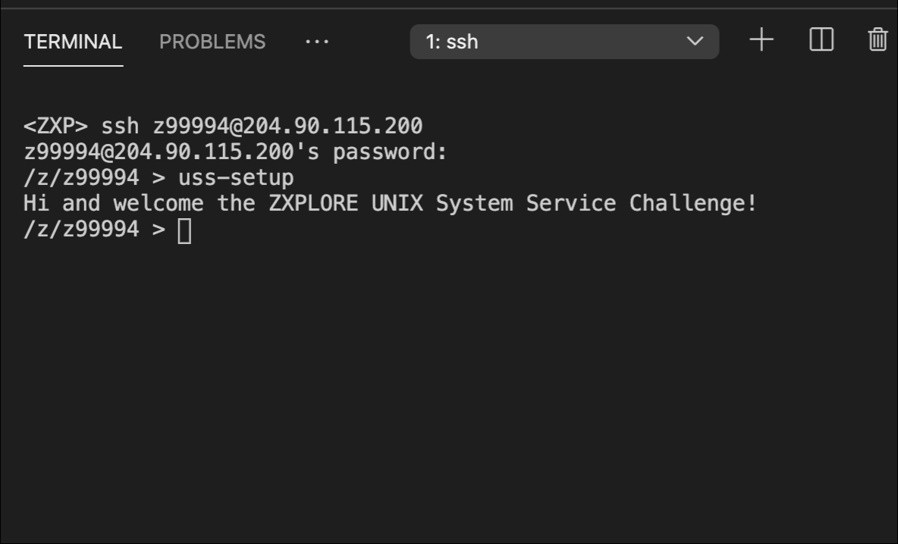

### Directory Listing — Exploring the Mainframe File System
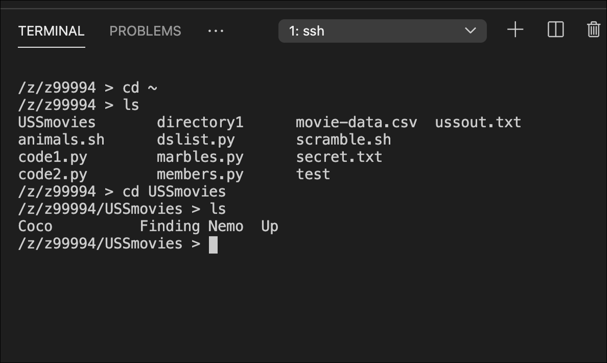

### VSCode File Explorer — Working With Mainframe Files Visually
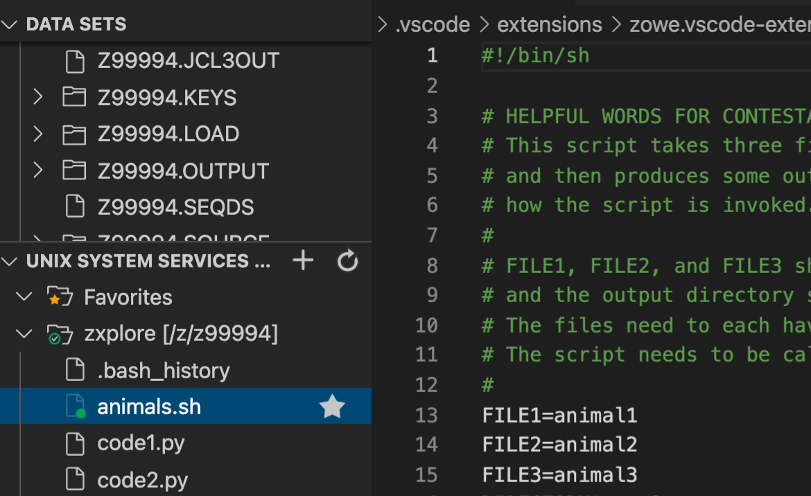

### Inside the animals.sh Script — Shell Script Code
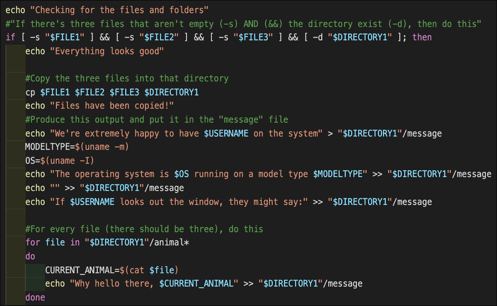

### Input Files — animal1, animal2, animal3 Created in VSCode
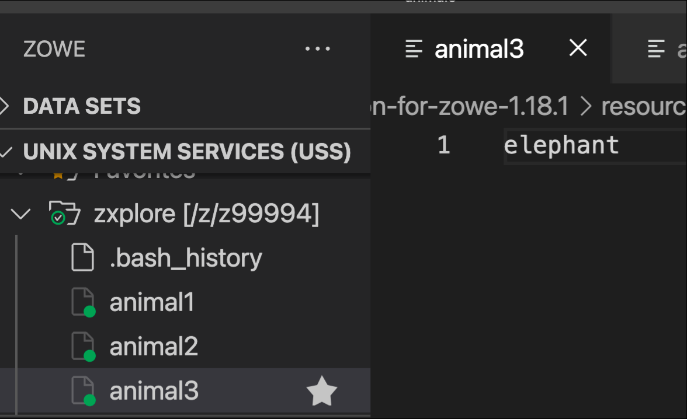

### Terminal — Listing Files After Setup
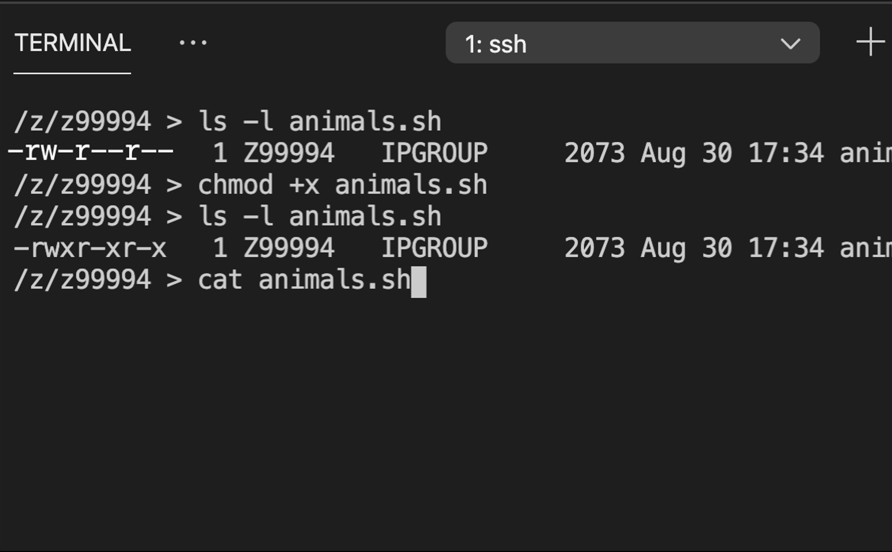

### Terminal — Applying chmod and Running the Script
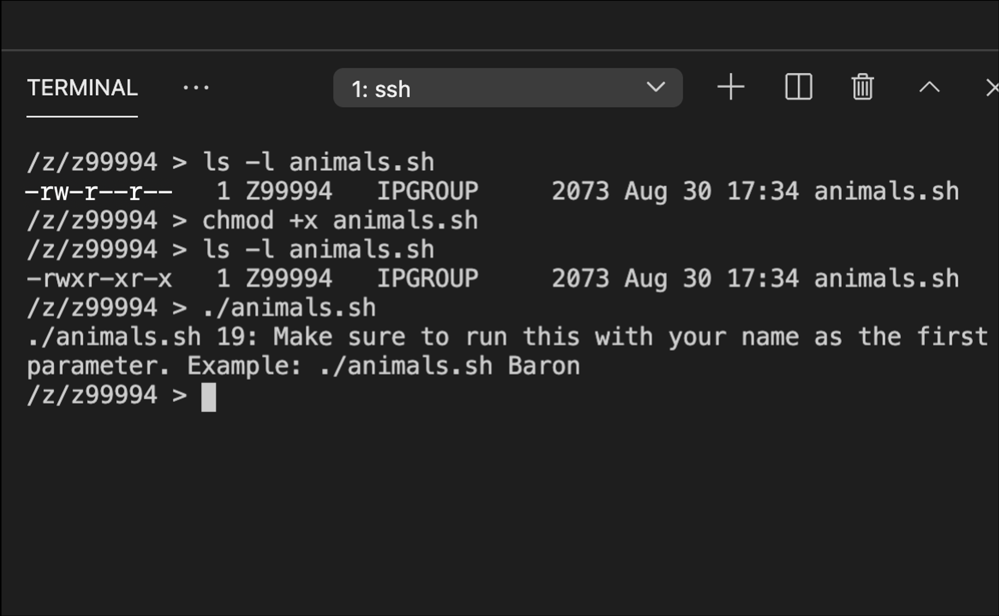

### Script Output — Successful Completion Message
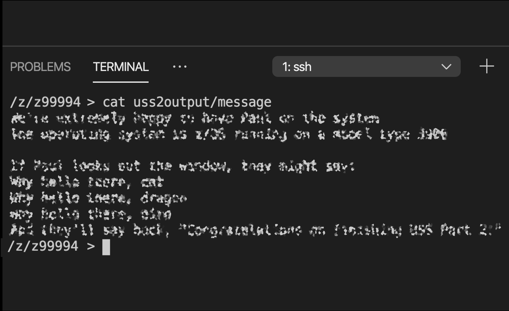

---

## 🧠 What Is a Mainframe, Really?

Most people interact with mainframes every day without knowing it. When you swipe your credit card, check your bank balance, or book a flight — a mainframe is almost certainly involved in the background.

```
Your Phone App  →  The Internet  →  Web Server  →  💻 IBM Z Mainframe
                                                    (Processes millions of
                                                     transactions per second)
```

**IBM Z = The gold standard for reliability, security, and scale.**  
This challenge proves I can work *directly inside* that infrastructure — not just around it.

---

## 🗺️ System Architecture

Here's a bird's-eye view of everything involved in this challenge:

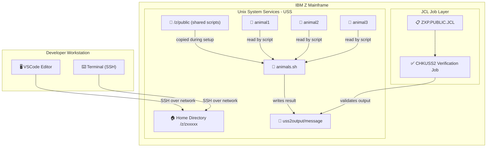

---

## 🔄 Step-by-Step Workflow

Exactly what happened, in order, from start to finish:

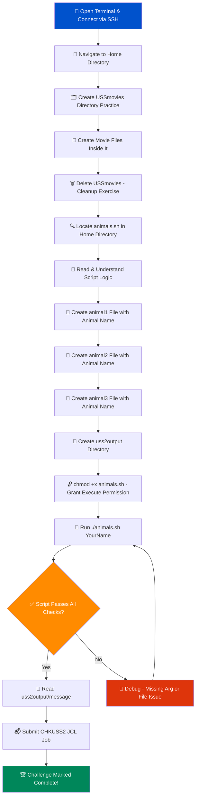

---

## 🔐 Security Features — File Permissions Deep Dive

One of the core concepts in this challenge is **Unix file permissions** — a security model that controls exactly who can do what with every file.

### How Unix Permissions Work

Every file on a Unix/Linux/mainframe system has three layers of access control:

```
-rwxr-xr-- animals.sh
 │││ │││ │││
 │││ │││ └── Others (everyone else): r-- = Read only
 │││ └└└──── Group (team members):  r-x = Read + Execute
 └└└──────── Owner (you):           rwx = Read + Write + Execute
```

### Permission Types Explained

| Symbol | Name | What It Means in Plain English |
|:------:|------|-------------------------------|
| `r` | **Read** | You can open and look at the file |
| `w` | **Write** | You can edit and save changes to the file |
| `x` | **Execute** | You can run the file like a program |
| `-` | **None** | No access for this action |

### Before and After `chmod`

| State | `ls -l` Output | What It Means |
|-------|---------------|---------------|
| Before `chmod +x` | `-rw-r--r-- animals.sh` | File exists but **cannot be run** |
| After `chmod +x` | `-rwxr-xr-x animals.sh` | File is now **executable as a program** |

### Why This Matters in the Real World

In enterprise environments, incorrect file permissions are a **leading cause of security vulnerabilities**. Setting the right permissions ensures:
- Only authorized users can run sensitive scripts
- Configuration files can't be accidentally overwritten
- Audit trails remain intact for compliance

---

## 🐚 The Shell Script — What `animals.sh` Actually Does

The `animals.sh` script is a real-world example of **automation on enterprise infrastructure**. Here's a plain-English breakdown of its logic:

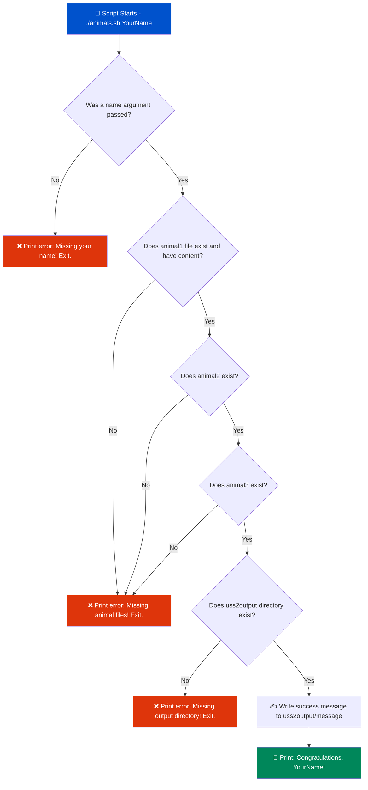

---

## 🛠️ Technical Specifications

| Category | Detail |
|----------|--------|
| **Platform** | IBM Z Mainframe (Enterprise Server) |
| **Operating Environment** | Unix System Services (USS) on z/OS |
| **Shell** | POSIX `sh` (Bourne Shell) |
| **Editor** | Visual Studio Code with IBM Z Open Editor |
| **Connection Method** | SSH (Secure Shell) — encrypted remote access |
| **Scripting Language** | Shell Script (`.sh`) with IF/FOR logic |
| **Job Submission** | JCL (Job Control Language) — mainframe job scheduler |
| **Verification** | CHKUSS2 job in ZXP.PUBLIC.JCL |
| **Difficulty Level** | Advanced |
| **Completion Time** | ~30 minutes |
| **Total Steps** | 8 |

---

## 📂 File & Directory Structure

Here's the exact layout of everything created during this challenge:

```
/z/zxxxxx/               ← Your home directory on the mainframe
│
├── animals.sh           ← The shell script (copied from /z/public)
├── animal1              ← Text file: contains name of Animal 1
├── animal2              ← Text file: contains name of Animal 2
├── animal3              ← Text file: contains name of Animal 3
│
└── uss2output/          ← Output directory created for the script
    └── message          ← Final output: congratulations message
```

> 💡 **Plain English:** Think of this like setting up a specific folder structure so a program knows exactly where to find its ingredients and where to put the finished result.

---

## 💻 Key Commands Used

Every command here runs directly on a live IBM Z mainframe — the same machines that power global banking systems:

| Command | What It Does | Real-World Analogy |
|---------|-------------|-------------------|
| `ssh user@host` | Securely connect to the mainframe | Showing your badge to enter a secure building |
| `mkdir uss2output` | Create a new directory | Making a new folder on your desktop |
| `touch animal1` | Create a new empty file | Creating a blank document |
| `ls -l` | List files with permissions and details | Viewing files in "Details" view in Windows Explorer |
| `ls -a` | Show all files including hidden ones | Enabling "Show hidden files" in your OS |
| `chmod +x animals.sh` | Grant execute permission to the script | Giving someone the "Run" permission on a program |
| `cat animal1` | Display file contents in terminal | Opening a file to read it, but without editing |
| `./animals.sh Webber` | Run the script with your name as input | Double-clicking a program to launch it |
| `pwd` | Print current directory path | Seeing your current location in a GPS |
| `rm -r USSmovies` | Delete a directory and everything in it | Sending a folder to the Recycle Bin (and emptying it) |
| `wc -l` | Count number of lines in a file | Word count, but for lines |
| `cat animal[123] \| wc -l` | Count lines across multiple files | Checking multiple documents at once |

---

## 🧩 `ls` Command Options Reference

The `ls` command is like your flashlight inside the mainframe filesystem — here's what each option does:

| Option | Full Meaning | What You See |
|--------|-------------|-------------|
| `ls` | Basic list | File and directory names only |
| `ls -l` | Long format | Owner, permissions, size, timestamp |
| `ls -a` | All files | Includes hidden files (names starting with `.`) |
| `ls -t` | Time sorted | Most recently modified files appear first |
| `ls -r` | Reverse order | Last file appears first |
| `ls -F` | Flagged types | Adds `/` for dirs, `*` for executables |
| `ls -la` | Long + All | Full details including hidden files |

---

## 🔒 Security Architecture Overview

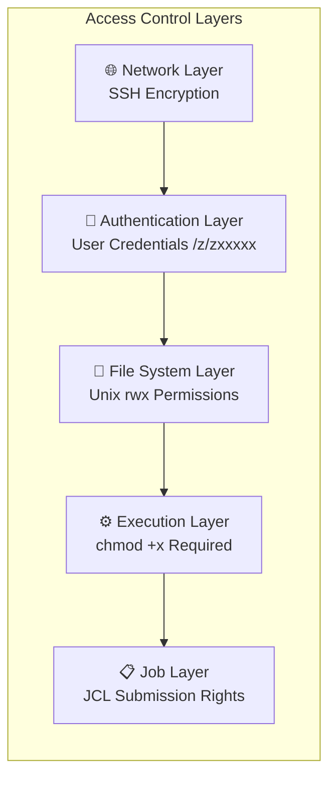

This challenge touches **every layer** of mainframe security:
1. **Network security** — SSH ensures all traffic is encrypted in transit
2. **Identity management** — Each user has a unique home directory (`/z/zxxxxx`)
3. **File permissions** — `chmod` controls who can read, write, and execute
4. **Job-level security** — JCL jobs have their own access control for batch processing

---

## 🌍 Why Mainframe Skills Are Rare (And Valuable)

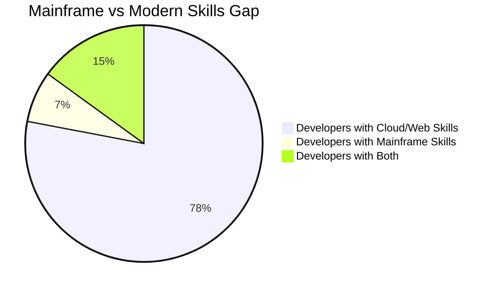

> The mainframe skills gap is **real and growing**. As experienced mainframe engineers retire, companies are desperately searching for engineers who can bridge modern development practices (Git, VSCode, SSH, scripting) with mainframe environments. **That's exactly what this certification demonstrates.**

---

## 📈 Skills Demonstrated in This Challenge

| Skill Category | Specific Skill | Industry Relevance |
|---------------|---------------|-------------------|
| **Systems Administration** | File permissions with `chmod` | Every Linux/Unix server in the world |
| **Scripting & Automation** | Shell scripting with IF/FOR logic | DevOps, CI/CD pipelines, automation |
| **Enterprise Mainframe** | z/OS Unix System Services | Banking, healthcare, government systems |
| **Remote Access** | SSH connection management | All cloud and server administration |
| **Developer Tooling** | VSCode + remote SSH workflows | Modern cloud-native development |
| **Job Scheduling** | JCL job submission | Enterprise batch processing |
| **Debugging** | Script troubleshooting and error resolution | All software engineering |
| **File I/O** | Reading/writing files from scripts | Data pipelines, ETL, automation |

---

## 🏅 Certification Context

This assignment is part of the **IBM Z Xplore Advanced Track** — a structured learning path that progresses from fundamentals to advanced mainframe engineering topics:

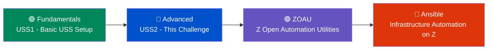

Each level builds directly on the last. By completing USS2, I demonstrated readiness for the **ZOAU and Ansible** challenges — the most advanced modules on the platform.

---

## 🚀 How to Reproduce This Challenge

> **Prerequisites:** IBM Z Xplore account + VSCode with IBM Z Open Editor extension

```bash
# Step 1: Connect to the mainframe via SSH
ssh zxxxxx@your-zxplore-host

# Step 2: Run the environment setup script
./uss-setup

# Step 3: Create required input files
touch animal1 animal2 animal3
mkdir uss2output

# Step 4: Add animal names to each file
echo "Bear" > animal1
echo "Deer" > animal2
echo "Eagle" > animal3

# Step 5: Verify 3 lines exist across all files
cat animal[123] | wc -l   # Should output: 3

# Step 6: Grant execute permission to the script
chmod +x animals.sh

# Step 7: Run the script with your name
./animals.sh YourName

# Step 8: Verify the output
cat ~/uss2output/message

# Step 9: Submit verification job in VSCode
# Find CHKUSS2 in ZXP.PUBLIC.JCL → Right-click → Submit Job
```

---

## 🔗 Related Projects & Resources

| Resource | Description |
|----------|-------------|
| [IBM Z Xplore](https://www.ibm.com/z/resources/zxplore) | Official IBM training platform for mainframe |
| [IBM Z Open Editor](https://marketplace.visualstudio.com/items?itemName=IBM.zopeneditor) | VSCode extension for mainframe development |
| [z/OS Unix System Services](https://www.ibm.com/docs/en/zos/latest?topic=uss) | Official IBM documentation |
| [JCL Reference](https://www.ibm.com/docs/en/zos/latest?topic=guide-jcl-reference) | Job Control Language documentation |

---

<div align="center">

**Built with grit on one of the world's most powerful computing platforms.**


*© 2025 — IBM Z Xplore challenge content is copyright IBM 2021–2025. This README documents my personal completion of the challenge.*

</div>
